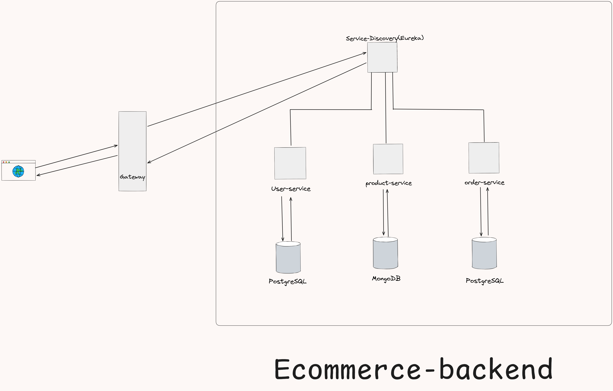

# E-commerce Microservices Backend

A robust, scalable, and secure backend system for an e-commerce platform built using **Java** and **Spring Boot**. This project demonstrates a distributed microservices architecture with **Service Discovery**, **API Gateway**, and **Polyglot Persistence**.

### System Architecture


*Figure 1: High-level architecture showing the request flow from the API Gateway to microservices (User, Product, Order) and their interactions with the Discovery Server and Databases.*


## 🚀 Key Features

* **Microservices Architecture:** Decomposed into three distinct services (**User**, **Product**, **Order**) for independent scalability and maintenance.
* **Centralized API Gateway:** Uses **Spring Cloud Gateway** as the single entry point, handling routing and acting as a unified facade for the client.
* **Service Discovery:** Integrated **Netflix Eureka** to allow dynamic registration and discovery of services without hardcoding IP addresses.
* **Zero-Trust Security:** Implements **JWT (JSON Web Token)** verification at individual service levels.
* **Role-Based Access Control (RBAC):** distinct privileges for `ADMIN` (inventory management) and `USER` (purchasing) roles.
* **Polyglot Persistence:**
    * **PostgreSQL** for relational data (Users, Orders) ensuring ACID compliance.
    * **MongoDB** for the Product Catalog, allowing flexible schema design for varying product attributes.
* **Inter-Service Communication:** Uses **Spring Cloud OpenFeign** for declarative REST client communication between the Order and Product services.
* **Data Integrity:** Implements `@Transactional` in the Order Service to ensure atomic operations and graceful rollbacks.

## 🛠️ Tech Stack

* **Language:** Java 17
* **Framework:** Spring Boot 3.5.5
* **Spring Cloud:** Gateway, Netflix Eureka, OpenFeign
* **Databases:** PostgreSQL, MongoDB
* **Security:** Spring Security, JWT
* **Build Tool:** Maven

## 🏗️ Architecture Overview

The system consists of the following components:

1.  **Discovery Server (Eureka):** The phonebook of the system. All services register here.
2.  **API Gateway:** Routes external requests to the appropriate microservice.
3.  **User Service:** Handles registration, login, and JWT generation. (PostgreSQL)
4.  **Product Service:** Manages inventory and product details. (MongoDB)
5.  **Order Service:** Processes purchases and communicates with Product Service to update stock. (PostgreSQL)

## ⚙️ Getting Started

Follow these instructions to set up the project locally on your machine.

### Prerequisites
* Java Development Kit (JDK) 17 or higher
* Maven
* PostgreSQL (Running on port `5432`)
* MongoDB (Running on port `27017`)

### 1. Clone the Repository
```
bash git clone [https://github.com/yourusername/ecommerce-backend.git](https://github.com/yourusername/ecommerce-backend.git)
cd ecommerce-backend

```


### 2.  **Start the Infrastructure:**
* Start **Eureka Server**(Discovery)
* Start **User Service**, **Product Service**, **Order Service** and **Api Gateway**


## 🔌 API Endpoints
| Method | Endpoint | Description | Access |
| :--- | :--- | :--- | :--- |
| `POST` | `/api/auth/login` | Login & Get Token | Public |
| `GET` | `/api/products/all` | View Catalog | Public |
| `POST` | `/api/order/checkout/{product_id}` | Place Order | User |
| `POST` | `/api/products/admin/add` | Add Inventory | Admin |

## 🔮 Future Improvements
* **Dockerization:** Containerizing services for Kubernetes deployment.
* **Circuit Breakers:** Implementing Resilience4j for fault tolerance.
* **Event-Driven:** Moving stock updates to Apache Kafka.

## 👤 Author
**Jatin Suryawanshi**
* **Linkedin:** www.linkedin.com/in/jatin-suryawanshi-149903332
* **Email:** jatinsurya2006@gmail.com
##
Built with ❤️ and Spring Boot.
